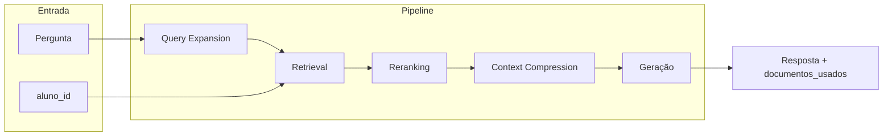

# Plano: RAG Avançado e Atualização de Memória

## Estado atual

- **RAG:** Retrieval simples com Chroma (`filter={"RA": aluno_id}`, k=10) + prompt + `gpt-4o-mini` com Langfuse (`[src/rag_engine.py](src/rag_engine.py)`).
- **Train:** Documents com metadados `RA` e `ANO` em `[src/train.py](src/train.py)`; chunk semântico em `[src/feature_engineering.py](src/feature_engineering.py)`.
- **API:** `POST /predict` já retorna `resposta` e `documentos_usados`; 404 para aluno inexistente (`[app/routes.py](app/routes.py)`).

## Arquitetura alvo (fluxo por request)

Conforme `[.cursor/skills/skill_mlops_backend.md](.cursor/skills/skill_mlops_backend.md)`, o pipeline recomendado:

- **Mínimo obrigatório (edital):** Retrieval com filtro RA + Geração com Langfuse (já atendido).
- **Para RAG sofisticado:** Retrieval com Self-Query + Híbrido, depois Reranking; opcionalmente Query Expansion e Context Compression.

---

## 1. Dependências

Adicionar em `[requirements.txt](requirements.txt)`:

- `langchain-community` (SelfQueryRetriever, BM25Retriever, EnsembleRetriever, compressors).
- `rank_bm25` (backend do BM25Retriever).
- `sentence-transformers` (cross-encoder para reranking).
- `lark` (exigido pelo SelfQueryRetriever).

Versões: compatíveis com LangChain já usado (langchain-core, langchain-chroma, langchain-openai).

---

## 2. Self-Query Retriever (metadata + linguagem natural)

- **Onde:** `[src/rag_engine.py](src/rag_engine.py)`.
- **O que:** Definir `AttributeInfo` para os metadados usados no RAG (ex.: `RA`, `ANO`) com nome, descrição e tipo; instanciar `SelfQueryRetriever` em cima do Chroma com LLM e document content description.
- **Restrição:** O edital exige filtro **obrigatório** `filter={"RA": aluno_id}`. O Self-Query deve ser usado de forma que o filtro por `RA` seja sempre aplicado (parâmetro `search_kwargs` com filtro fixo por aluno, ou combinação do filtro gerado pelo Self-Query com o RA). Garantir que não haja retrieval sem filtro por RA.

Referência: [Chroma Self-Query](https://python.langchain.com/docs/integrations/retrievers/self_query/chroma_self_query).

---

## 3. Busca híbrida (BM25 + vetorial)

- **Onde:** `[src/rag_engine.py](src/rag_engine.py)`.
- **Problema:** BM25 precisa do corpus de texto; o corpus relevante é “todos os chunks do aluno”, que depende de `aluno_id`. Não há índice BM25 global persistido hoje.
- **Abordagem:** Por request, obter os documentos do aluno com `vectorstore.get(where={"RA": aluno_id})`, construir `BM25Retriever.from_documents(docs, k=k)` com esse subconjunto e usar `EnsembleRetriever` com o retriever vetorial (Chroma com `filter={"RA": aluno_id}`) e o BM25, com pesos configuráveis (ex.: 0.5, 0.5). Assim mantemos filtro RA obrigatório e híbrido só sobre os dados daquele aluno.
- **Detalhe:** O retriever “base” que alimenta o pipeline (e depois o reranker) passa a ser o Ensemble (vetorial + BM25), ambos sempre restritos ao mesmo `aluno_id`.

---

## 4. Reranking (cross-encoder)

- **Onde:** `[src/rag_engine.py](src/rag_engine.py)`.
- **O que:** Usar `CrossEncoderReranker` (modelo ex.: `cross-encoder/ms-marco-MiniLM-L-6-v2`) com `top_n` fixo (ex.: 6–8) sobre os documentos já recuperados pelo retriever híbrido; integrar via `ContextualCompressionRetriever(base_compressor=reranker, base_retriever=ensemble_retriever)`.
- **Dependência:** `sentence-transformers` (e possivelmente `langchain_community` para o compressor, conforme API atual do LangChain).

---

## 5. Opcionais (configuráveis ou fase seguinte)

- **Query expansion:** Antes do retrieval, expandir a pergunta em 2–3 variantes (sinônimos/reformulações) via LLM; fazer retrieval para cada variante; unir e deduplicar documentos; aplicar reranking sobre o conjunto unificado. Aumenta recall e custo por request.
- **Context compression (LLMChainExtractor):** Após o reranking, comprimir os chunks com um LLM (extrair só trechos relevantes à pergunta) via `LLMChainExtractor` + `ContextualCompressionRetriever`. Reduz ruído e tamanho do contexto; aumenta latência e custo.
- **HyDE (Hypothetical Questions):** Alterar `[src/train.py](src/train.py)` para, por chunk, gerar perguntas hipotéticas com LLM, indexar essas perguntas no Chroma com metadados que referenciem o chunk pai (ex.: `parent_chunk_id` ou conteúdo); no retrieval, mapear hits em “perguntas” de volta ao chunk pai. Aumenta recall e complexidade de treino e índice.

Recomendação: implementar primeiro Self-Query + Híbrido + Reranking; deixar query expansion, context compression e HyDE como flags ou fases posteriores para não estourar escopo.

---

## 6. Ajustes no motor RAG

- **Assinatura e contrato:** Manter `query(self, aluno_id: str, pergunta: str) -> tuple[str, list[str]]` e o tratamento de `AlunoNaoEncontradoError` para não quebrar `[app/routes.py](app/routes.py)` e `[API_REFERENCE.md](API_REFERENCE.md)`.
- **Langfuse:** Manter `CallbackHandler` em todos os `.invoke()` (retriever e chain de geração), conforme skill.
- **Modelo:** Manter `gpt-4o-mini` para geração (e para Self-Query/expansion/compression se usados).
- **Configuração:** Prever constantes ou variáveis de ambiente para: ativar/desativar query expansion, compression, HyDE; k do retrieval; top_n do reranker; pesos do ensemble.

---

## 7. Testes

- **Onde:** `[tests/test_api.py](tests/test_api.py)` e, se necessário, novo `tests/test_rag_engine.py`.
- **O que:** Manter testes atuais (200 com estrutura, 404, 422); garantir que mocks do RAG continuem passando. Se houver lógica nova isolada (ex.: construção do ensemble por aluno), adicionar testes unitários com documentos mockados para não depender de Chroma/OpenAI em CI.

---

## 8. Atualização de memória (ao terminar)

- **progress.md:** Registrar a conclusão da etapa “RAG avançado” (Self-Query, híbrido, reranking; e, se implementados, query expansion, context compression, HyDE), listar arquivos alterados e manter a fase atual do projeto.
- **findings.md:** Registrar apenas se surgir nova anomalia (ex.: comportamento estranho com BM25 por aluno, impacto de reranker em latência, ou edge case em Self-Query com RA).

---

## Ordem de implementação sugerida

| #   | Etapa                                   | Arquivos principais                                      |
| --- | --------------------------------------- | -------------------------------------------------------- |
| 1   | Dependências                            | `requirements.txt`                                       |
| 2   | Self-Query + filtro RA obrigatório      | `src/rag_engine.py`                                      |
| 3   | Busca híbrida (Chroma + BM25 por aluno) | `src/rag_engine.py`                                      |
| 4   | Reranking com CrossEncoderReranker      | `src/rag_engine.py`                                      |
| 5   | Testes e ajustes                        | `tests/test_api.py`, opcional `tests/test_rag_engine.py` |
| 6   | Atualizar memória                       | `progress.md`, `findings.md` (se houver descobertas)     |

Opcionais em seguida: query expansion, context compression e HyDE (treino + retrieval).